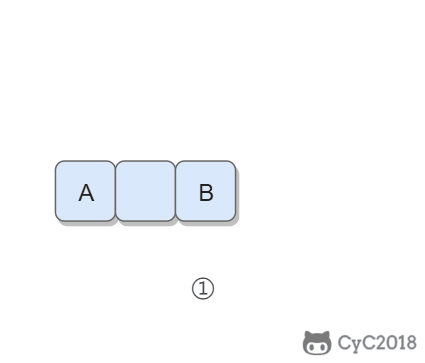

将一个字符串中的空格替换成 "%20"。

Input:
"A B"

Output:
"A%20B"


思路：
由于一个空格要加入三个字符，所以需要先遍历一遍统计一共有几个空格，就在String的后面加几个空格，然后两个指针，一个指向开始时最后一个字符，另一个指向加完空格之后的位置。


```java
public String replaceSpace(StringBuilder str){
    int p1 = str.length-1;
    for(int i=0;i<str.length;i++){
        if(str.charAt(i) == ' '){
            str.append("   ");    
        }
    }
    int p2 = str.length-1;
    while(p1>=0&&p1<=p2){
        char c = str.charAt(p1--);
        if(c == ' '){
            str.setCharAt(p2--,0);
            str.setCharAt(p2--,2);
            str.setCharAt(p2--,%);
        }else{
            str.setCharAt(p2--,c);
        }
    }
    return str.toString();

}
```